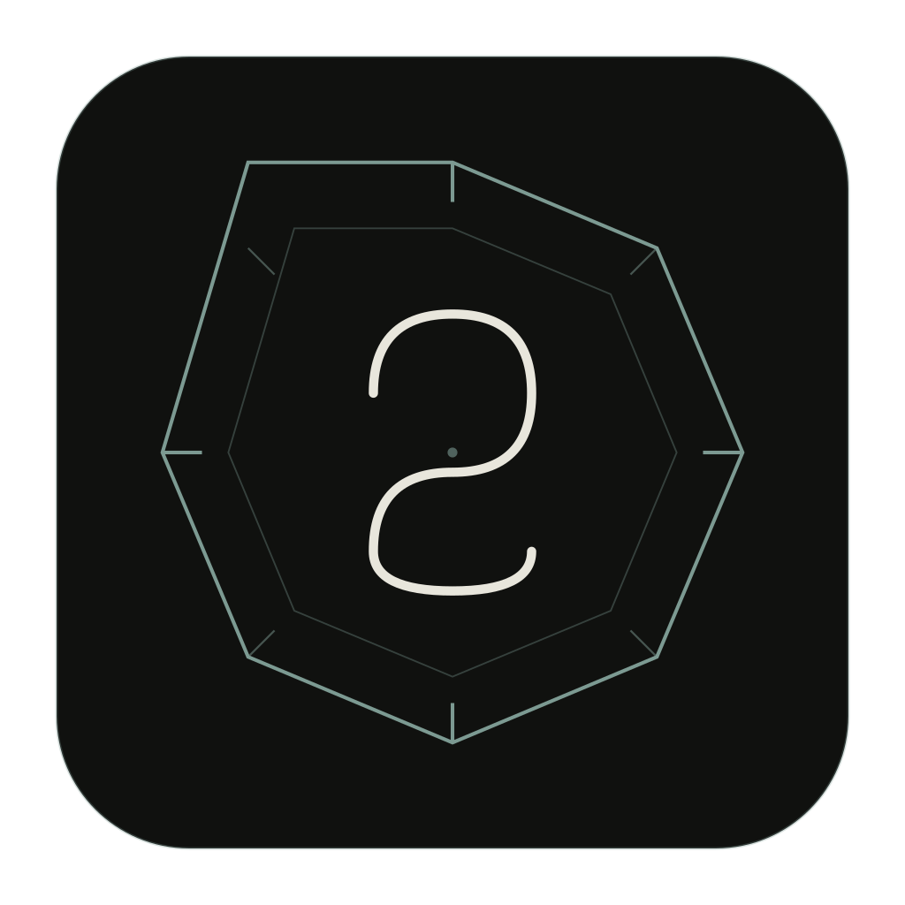
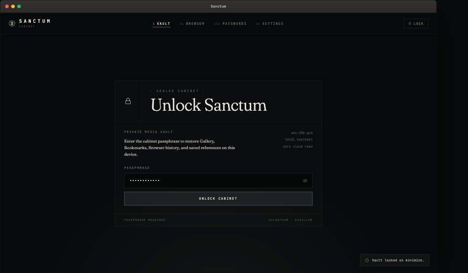
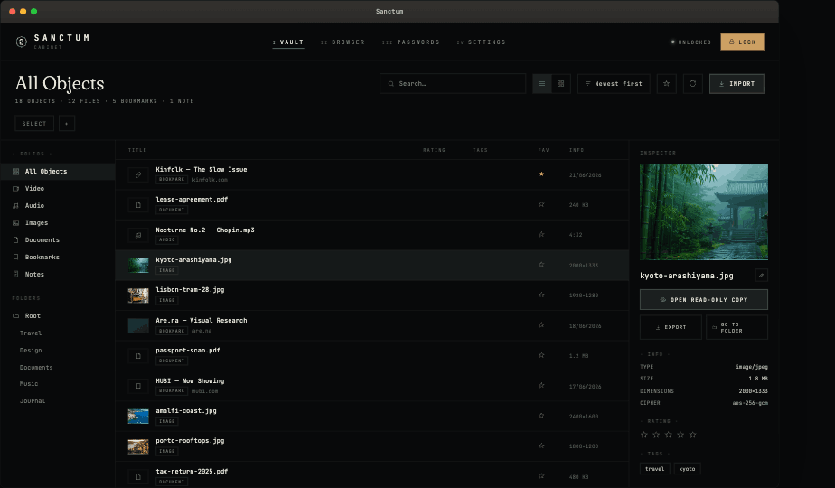
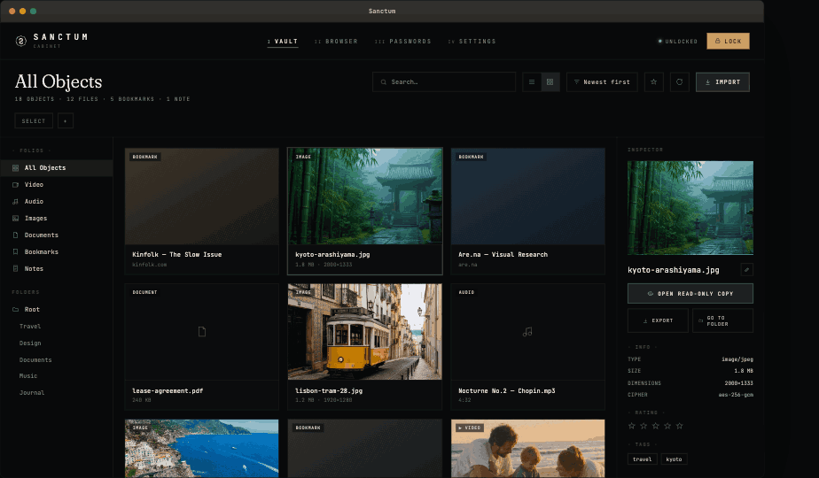
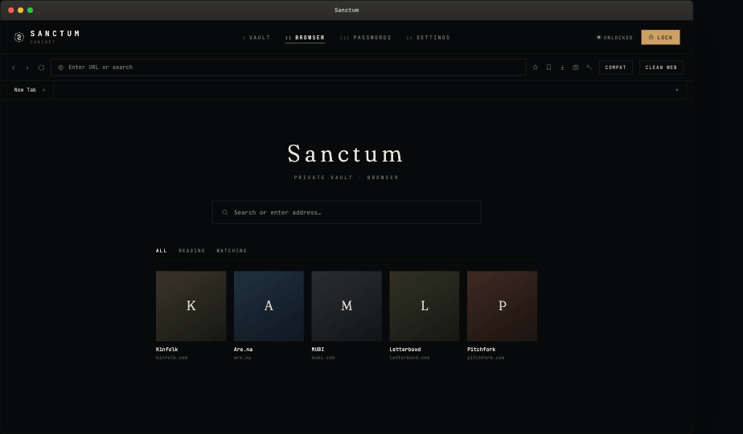

# Sanctum

**A local-first encrypted vault for files, bookmarks, notes, and passwords.**

No cloud. No accounts. No telemetry. Open source so you don't have to take our word for it.

[Download](https://sanctumvault.app/download) · [How to Use](https://sanctumvault.app/how-to-use) · [FAQ](https://sanctumvault.app/faq) · [sanctumvault.app](https://sanctumvault.app)

---

## What is Sanctum?

Sanctum is a desktop app for Windows and macOS that keeps your private files, notes, bookmarks, and passwords encrypted and out of sight — even from other accounts or people who share your machine.

Everything happens locally. There's no server, no sync, no account system, and no analytics. Your vault password never leaves your device, and Sanctum can't see inside your vault even if it wanted to.

This repository contains the full source code. It's published so the encryption and privacy claims below can be checked rather than just trusted.

- 🔒 **AES-256-GCM** encryption for every file, with a unique IV per item
- 🔑 **Argon2id** key derivation — your password is never stored, anywhere
- 💻 **Local only** — no cloud, no sync, no relay
- 📡 **Zero telemetry** — no analytics, no crash reporting, no network calls except the ones you make yourself in the built-in browser
- 🗂️ Files, bookmarks, notes, and passwords live together in one encrypted vault
- 🌐 Built-in private browser with save-to-vault, isolated from your system browser
- ⚡ Lock hotkey + minimise-on-lock for instantly getting it out of sight

---

## Screenshots

   
  Unlock screen — passphrase-derived key, never stored

   
  Mixed vault — files, bookmarks, and notes in one list

   
  Grid view with inspector panel

   
  Built-in private browser — isolated session, save-to-vault

---

## Download

Prebuilt installers for Windows and macOS are available on the [Releases](../../releases) page and at [sanctumvault.app/download](https://sanctumvault.app/download), with SHA-256 checksums for verification.

Sanctum is free to use, no time limit, no feature restrictions. If you'd like to support development, there's a voluntary one-time contribution option — never required.

---

## Why source-available?

Privacy and encryption tools live or die on trust. Rather than ask you to take a security model on faith, the full implementation is here:

- `src/main/services/auth` — vault creation, unlock, lock, password change
- `src/main/services/vault` — file encryption, storage, backup/restore
- `src/preload` — the exact `contextBridge` surface exposed to the renderer

If you know TypeScript, you can verify exactly what happens to your data.

**This repo is open for reading and auditing, not for contributions.** Issues are welcome for bugs, security reports, and feature discussion. Pull requests are not accepted at this time — see [Contributing](#contributing) below.

---

## Security Model

| | |
|---|---|
| **File encryption** | AES-256-GCM, random IV + auth tag per file |
| **Key derivation** | Argon2id, password never stored — only a verifier hash |
| **Filenames** | Encrypted separately from file content |
| **Thumbnails** | Encrypted, stored as database BLOBs — never plain image files on disk |
| **Bookmarks / Notes / Passwords** | Encrypted at rest in SQLite |
| **Master key** | Held only in memory while unlocked, zeroed on lock |
| **Browser session** | Isolated Electron partition, separate from vault state |
| **Lockout** | Failed unlock attempts trigger a timed lockout |

Sanctum protects data **at rest**. It does not protect decrypted content from malware or another process with full access to your unlocked session, and the built-in browser does not include a VPN — your network traffic is still visible to your ISP or network. See the [FAQ](https://sanctumvault.app/faq) for the full picture.

Full technical detail lives in [`ARCHITECTURE.md`](./ARCHITECTURE.md) — database schema, IPC design, process architecture, and backup format.

---

## Tech Stack

Electron · TypeScript · React · SQLite (`better-sqlite3`) · Node `crypto` (AES-256-GCM) · `argon2` (Argon2id)

Full stack table and project structure: [`ARCHITECTURE.md`](./ARCHITECTURE.md)

---

## Contributing

Sanctum does not accept pull requests at this time. The codebase is small, opinionated, and maintained by one person — keeping changes centralised is what makes the security claims in this README possible to stand behind.

You're welcome to:
- Open an **issue** for bugs or unexpected behaviour
- Open an issue to **report a security concern** (see below)
- Open an issue to **suggest a feature** — no promises, but all read
- **Fork and modify** for your own personal use, subject to the license

You're not able to:
- Open a pull request — these will be closed unreviewed
- Redistribute a modified version as "Sanctum" — see [`LICENSE`](./LICENSE)

### Reporting a security issue

If you find a genuine security vulnerability, please open an issue marked `security` with as much detail as you can. *(A private disclosure address may be added here.)*

---

## License
 
Licensed under [GPL-3.0](./LICENSE).
 
The "Sanctum" and "Sanctum Vault" names and logo are not covered by this license for use in derivative or competing distributions — see the notice at the top of [`LICENSE`](./LICENSE) for details.

---

## Disclaimer

Sanctum is provided as-is. There is no password recovery — if you forget your vault password, your data cannot be recovered, by design. Use is intended for lawful personal use only. See the full [Terms](https://sanctumvault.app/terms) for details.

---

silentium · sigillum

